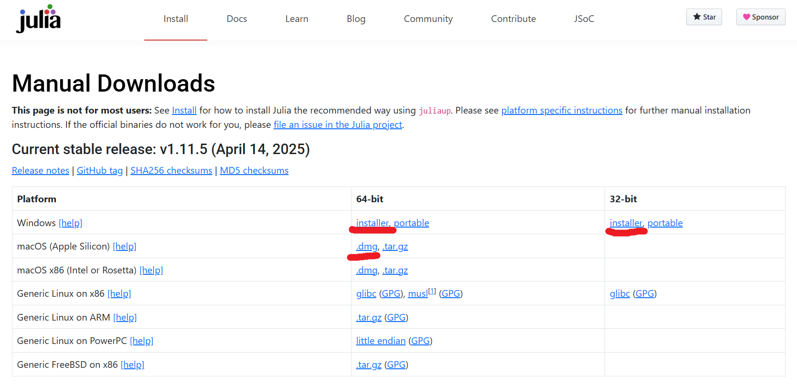
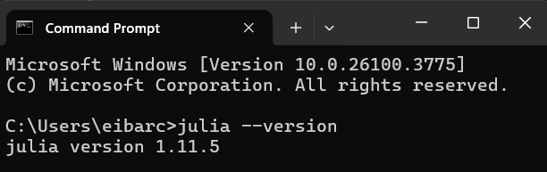
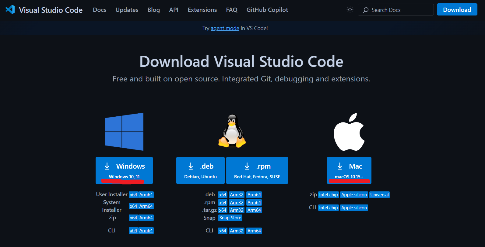
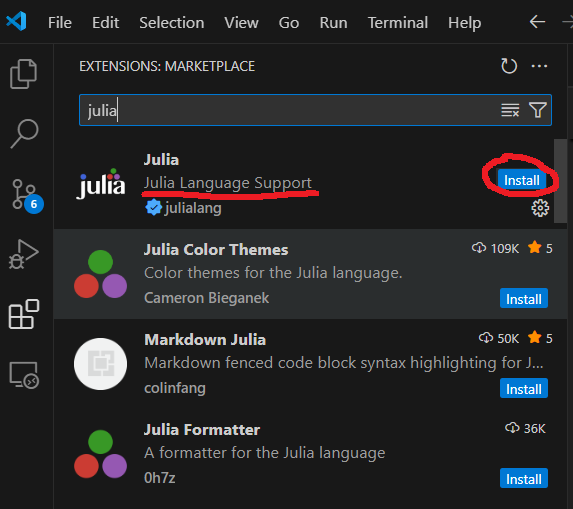
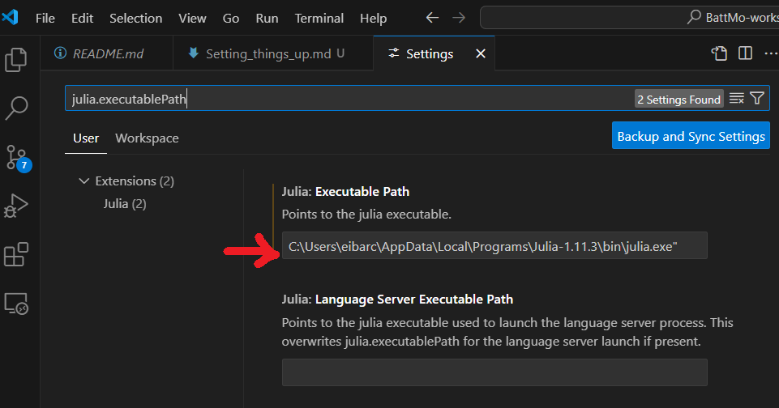
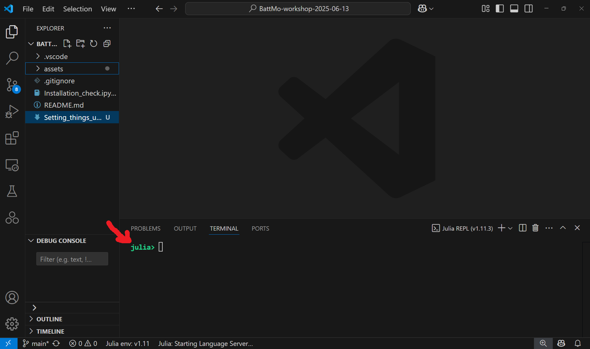
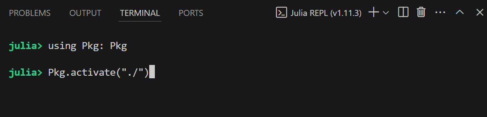

# BattMo.jl: Julia + VS Code Setup


### Required Software

To run BattMo.jl we will need three pieces of software:

- **A Julia compiler**. The compiler is the software that translates our code into instructions that our PC can follow to carry out operations. Since BattMo.jl is written in Julia, we will need the Julia compiler to build models and run simulations.
- **A code editor**. Any text editor can be used to write code (e.g. Windows Notepad). However, there are specialized editors tailored to write, test, and debug code. These come with lots of useful features. We prefer VS Code and we will show how to set it up. However, you can use other [editors tailored to develop code](https://en.wikipedia.org/wiki/List_of_text_editors) if you are interested.
- **Integration between Julia and the code editor**. This integration is sometimes optional but quite useful. It essentially facilitates the process of writing code, sending it to the compiler to run computations, showing you the results and handling errors. The integration requires configuring the text editor to communicate with Julia. In VS Code, we will install a Julia extension.

### We isolate activities into Julia Projects

Once the necessary software is installed, we will walk you through starting a project, i.e. creating a separate directory where you will write your battery simulation code, keep your used packages, store data, save results, etc.

When you install Julia you usually make use of packages. A package is a collection of reusable code, such as functions and tools, that you can add to your project to extend its capabilities without writing everything from scratch.

It is good practice to create a project, where all packages for a task are isolated from the packages of a different task. In essence, to start a Julia project we:

- Create a new folder, where we will store our code, data and results.
- Create a Julia project environment within the folder. The environment is represented as two files: `Project.toml` and `Manifest.toml`, which keep track of the packages you have installed.
- When we start working on our code, we activate the environment to ensure we have the packages we need available to us. The environment also ensures that new packages are installed and tracked in our folder and remain isolated from other projects.

# 1. Install Julia

We recommend installing Julia from the official installer at the [Julia Downloads page](https://julialang.org/downloads/).

### Installation for windows

- In the table of "Current Stable Releases", click on the installer in either 64-bit or 32-bit. Most modern Windows PC use a 64-bit system so we recommend installing this version. However, if you have issues, install the 32-bit version. If you want to be sure, you can check which system you use by going to Start, search for System Information, and check for "System Type". 64-bit versions look like _"x64"_, while 32-bit version look like _"x86"_.
- When the download finishes, click on the file to start the installation.

> **Important** Make sure to enable the option of "Add Julia to Path".

- When the installation is complete you can close the installation window.

### Installation for MacOS

- Download the `.dmg` from the same page, open it, and drag Julia to your Applications folder.



### Verify installation

Open the command line (or terminal), which is a text-based way of interacting with a lot of software in your computer.

- On Windows, go to Start, search for Command Prompt (cmd) or PowerShell and open it.
- On macOS, open the Terminal application (found in Applications > Utilities).

Type the following command:

```bash
julia --version
```



You should see an output wth the format `julia version 1.x.x.`. If not, you might need to add Julia to PATH, i.e. configure your system to run Julia from any terminal without needing to specify its full installation path; see the Troubleshooting section for instructions on how to add Julia to PATH.

# 2. Install VS Code

To install VS Code, follow the instructions from [the website](https://code.visualstudio.com/download) and the installer will guide you through the process.



> **Important** During the installation steps, make sure to enable the option **Add VS Code to Path**.

# 3. Install the Julia Extension in VS Code

The Julia extension for VS Code provides useful tools tailored to develop Julia code, e.g. highlighting of wrong syntax, and seamless integration with the Julia compiler.

### Install

- Open VS Code, open the Extensions pane (⇧⌘X on macOS, Ctrl+Shift+X on Windows).

- Search for Julia (by “Julia Language Support” team) and click Install.



### Configure

- Still within VS Code, open Settings with `Ctrl+,` on Windows (note the comma ",") or ⌘ on macOS.

- Ensure `julia.executablePath` points to the location of your Julia `.exe` file. To find the location:
  - Open PowerShell and run `Get-Command -ShowCommandInfo julia`.
    - If you get an error, you might need to add Julia to PATH, see troubleshooting section at the end of these instructions.
  - Copy the path that appears under "Definition". The path should end with the name of the executable file, for example: `"C:\Users\<your_username>\.julia\juliaup\julia-1.11.0+0.x64.w64.mingw32\bin\julia.exe"`. Note the path ends with `julia.exe`.
  - Paste the path into the VS Code configuration `julia.executablePath`.



### Verify configuration

In VS Code, press `Shift + Ctrl + P`, search for "Julia: Start REPL" and select it. After several seconds (may be upwards of a minute the first time), a terminal window should appear within VS Code. In there you should see `julia> ` in green, which means the REPL is up and ready to accept commands. Try running `2+2`!



# 4. Setup a project

### Create an environment

- Create a new folder anywhere in your computer, using your file explorer; for instance: "Documents/BattMo_workshop".
- In VS Code, go to the top left corner and click on `File -> Open Folder` and navigate to your created folder to open it in VS Code. You might see VS Code warning you whether you trust the authors, you should click _yes_. However, generally is good practice to be skeptical about opening code whose authors you dont know or trust.
- Open the Julia REPL from VS Code: Run the `Shift + Ctrl + P` command and select "Julia: Start REPL".
- In the REPL, run the following commands one by one:

```
julia> using Pkg: Pkg
julia> Pkg.activate("./")
julia> Pkg.instantiate()
```



- These commands:
  - Load the Package manager of Julia `Pkg`.
  - Activate the environment, which will generate a `Project.toml` file that will keep track of all packages installed in the environment once you start installing them.
  - Instantiate the environment, which installs all the packages listed in the `Project.toml`, and creates a new `Manifest.toml` that tracks dependencies to other packages.

### Verify the installation

We will try running a code notebook to verify the installation is OK.

- Go to the [notebook we have prepared for the workshop](https://github.com/BattMoTeam/BattMo-workshop-2025-06-13/blob/main/Installation_check.ipynb).
- Download the file by clicking on the "Download Raw" button on the top right of the file preview.
- Move the file into the folder where you previously created your environment.
- Open VS Code in the project folder (if not already opened yet) and click on the `Installation_check.ipynb` file.
- Follow the instructions in the notebook step by step.

> If the notebook runs fine, **you are ready for BattMo workshp!**

# Troubleshooting

### Add Julia to PATH

**Windows:**

- First, find the location where Julia is installed.
  - In windows, these locations can be:
    - `C:\Users\<YourUsername>\AppData\Local\Programs\Julia-<version>`
    - `C:\Users\<YourUsername>\.julia\juliaup\julia-1.xx.yy+zz.x64.w64.mingw32\bin`
    - `C:\Program Files\WindowsApps\<String>.Julia-<version>`
    - `C:\tools\julia-<version>`
- Go to the start menu and search for "Environment Variables".
- Under the list of "User variables", select "Path" and click the "New" button. Then, add in the text box the path to the binary directory. It should look like `C:\Users\<user_name>\.julia\juliaup\julia-1.xx.yy+zz.x64.w64.mingw32\bin`

**macOS/Linux:**

- FInd the location where Julia is installed. In MacOS these could be:
  - `/Applications/Julia-<version>.app/Contents/Resources/julia/bin`
  - `/usr/local/Cellar/julia/<version>/bin`
  - `~/.juliaup/bin (managing multiple versions)`
- Add to your shell startup (e.g. ~/.bash_profile or ~/.zshrc):
  `export PATH="/Applications/Julia-1.x.app/Contents/Resources/julia/bin:$PATH"
`

**Finally** reopen your terminal and rerun `julia --version`.
